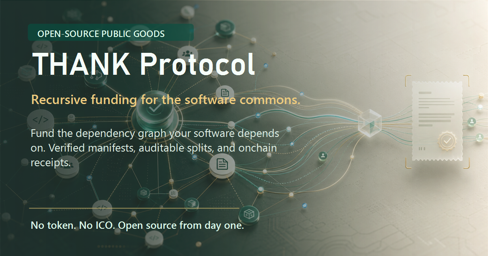

# THANK Protocol



Recursive funding for the software commons.

THANK is an open-source protocol and local-first toolchain for funding the software that modern projects depend on. A project publishes a `thank.yaml` manifest, donors scan a dependency tree, verified upstream projects are resolved, and funds can be routed through auditable split rules.

The goal is practical public-goods funding, not speculation.

THANK is experimental infrastructure. It is not an investment product. Donations do not buy tokens, equity, governance power, special access, future allocations, or any expectation of financial return.

## Why THANK Exists

Open-source funding is usually one-hop: a donor funds the project they can see.

Real software is recursive. A web app depends on packages, frameworks, runtimes, build tools, test tools, CI actions, cryptography libraries, and maintainers several layers upstream. THANK makes that dependency graph fundable.

The core workflow is:

1. A project publishes a `thank.yaml` funding manifest.
2. Maintainers verify ownership through GitHub and stronger proofs over time.
3. A donor or company scans a repository.
4. THANK resolves dependencies with verified funding metadata.
5. A funding plan aggregates allocations by verified upstream project.
6. Onchain contracts route funds into claimable recipient credits.
7. Receipts provide a public audit trail.

## What Is In This Repository

- TypeScript CLI for manifests, scanning, funding plans, receipts, and commitments
- Multi-ecosystem dependency scanner
- Static verified project registry
- Solidity contracts for project registration, split registration, routing, receipts, and treasury custody
- In-process EVM behavior tests for protocol routing and claims
- Testnet deployment script, deployment manifest format, and CI workflow
- Protocol specification, threat model, manifest spec, security policy, and examples

The local website/dashboard prototype is intentionally excluded from the protocol repo. The protocol surface is the manifest, CLI, registry, contracts, and tests.

## Current Status

Phase 0/1 protocol MVP.

The CLI, manifest commitments, scanner, registry, and contracts are local-first. The contracts compile and have EVM behavior tests, but they have not been audited. Do not use these contracts with production funds until they have had external review, testnet proving, and a deployment policy.

## Install

```bash
npm install
npm run build
```

Run the full verification suite:

```bash
npm run typecheck
npm test
npm audit
```

## CLI

After `npm run build:cli`, use the CLI through `node dist/src/cli.js`. If installed globally, the binary is `thank`.

```bash
node dist/src/cli.js init
node dist/src/cli.js validate examples/thank.yaml
node dist/src/cli.js commit examples/thank.yaml
node dist/src/cli.js scan examples/sample-project
node dist/src/cli.js graph examples/sample-project --amount 1000 --currency USDC
node dist/src/cli.js fund examples/sample-project --amount 1000 --currency USDC
node dist/src/cli.js badge examples/thank.yaml
node dist/src/cli.js verify examples/thank.yaml
```

### Deterministic Commitments

`thank commit` creates deterministic protocol identifiers:

```text
projectId = sha256("thank:v1:project:" + lowercase(owner/repo))
manifestHash = sha256(canonicalManifestJson + "\n")
```

Example:

```bash
node dist/src/cli.js commit examples/thank.yaml
```

## Example Manifest

```yaml
version: 1

project:
  name: example-library
  repo: example/example-library
  website: https://example.org
  description: Example open-source library using THANK Protocol.

wallets:
  primary:
    address: "0x0000000000000000000000000000000000000000"
    chains:
      - ethereum
      - base
      - optimism
      - arbitrum

maintainers:
  - github: alice
    share: 60
    wallet: "0x1111111111111111111111111111111111111111"
  - github: bob
    share: 40
    wallet: "0x2222222222222222222222222222222222222222"

splits:
  maintainers: 80
  upstream: 19.5
  protocol: 0.5

upstream:
  - repo: openssl/openssl
    share: 10
  - repo: curl/curl
    share: 5
  - repo: zlib-ng/zlib-ng
    share: 4.5

verification:
  github: required
  signed_commit: optional
  dns_txt: optional
```

See [docs/manifest-spec.md](docs/manifest-spec.md) for validation rules.

## Dependency Scanner

The scanner currently supports:

```text
package.json
package-lock.json
pnpm-lock.yaml
yarn.lock
requirements.txt
pyproject.toml
Cargo.toml
Cargo.lock
go.mod
composer.json
Gemfile
pom.xml
*.csproj
Dockerfile
.github/workflows/*.yml
```

Funding plans aggregate by verified upstream repository. If `react` and `react-dom` both resolve to `facebook/react`, the plan creates one allocation for `facebook/react` with combined weight.

## Contracts

Contracts live in [contracts/src](contracts/src).

- `ProjectRegistry.sol`: maps project IDs to repository metadata, manifest hashes, controllers, and verification levels.
- `SplitRegistry.sol`: stores split rules for active, verified projects and reads controller authority from `ProjectRegistry`.
- `ThankRouter.sol`: queues native ETH or ERC-20 claimable credits according to registered splits.
- `ReceiptNFT.sol`: optional non-transferable symbolic support receipt.
- `Treasury.sol`: minimal treasury custody contract.

Compile contracts:

```bash
npm run compile:contracts
```

The compiler target is pinned to `evmVersion: "shanghai"`. Changing the EVM target requires rerunning behavior tests against the intended deployment hardfork.

### Testnet Deployment

Copy [.env.example](.env.example), set the target chain, RPC URL, deployer key, and optional protocol owner, then run:

```bash
npm run deploy:testnet
```

Deployment manifests are written to [deployments](deployments). See [docs/testnet-deployment.md](docs/testnet-deployment.md) for the checklist and [docs/token-policy.md](docs/token-policy.md) for the recommended asset allowlist posture.

## Protocol Invariants

- No native token is required for v1.
- Payments use existing assets such as ETH, USDC, and DAI.
- Split totals must equal `10_000` basis points.
- Split recipients cannot be duplicated.
- Split updates require an active, verified project.
- Split authority comes from `ProjectRegistry`, not a separate controller map.
- Router funding uses claimable credits, so one reverting recipient cannot block a funding transaction.
- Token funding measures actual inbound balance delta before allocating credits.
- Receipts are proof-of-support artifacts, not transferable investment claims.

See [docs/protocol-spec.md](docs/protocol-spec.md) and [docs/threat-model.md](docs/threat-model.md).

## Tests

```bash
npm test
```

The test suite covers:

- Manifest validation
- Dependency scanning
- Funding-plan aggregation
- Manifest commitments
- Solidity compile surface
- EVM behavior for native routing, ERC-20 routing, claims, duplicate split rejection, controller authorization, unverified projects, and deactivated projects

## Repository Map

```text
contracts/       Solidity protocol contracts
deployments/     Public deployment records and deployment format notes
docs/            Protocol, scanner, CLI, manifest, and threat-model docs
examples/        Example manifest and sample project
registry/        Static verified project registry
scripts/         Contract compiler and deployment scripts
src/cli.ts       CLI entrypoint
src/lib/         Shared protocol, scanner, registry, graph, and manifest logic
tests/           Unit and EVM behavior tests
assets/promo/    Promotional images for README, social cards, and announcements
```

## Promotional Assets

Ready-to-use protocol images live in [assets/promo](assets/promo):

- `thank-social-card.png` for GitHub/social previews
- `thank-banner.png` for project pages and announcements
- `thank-square.png` for posts and profile surfaces
- `thank-protocol-background.png` as the clean source background

## Principles

- No ICO
- No pre-mine
- No founder token allocation
- No price promises
- No referral rewards
- No exchange-listing hype
- Open source from day one
- Auditable contracts
- Transparent funding flows
- Maintainer-first governance

## Support

Donations support development, documentation, audits, testing, and infrastructure.

BTC donations:

```text
bc1q0m7qw44q5twntp6hu92uaz8m7yqj6qqra4y05e
```

Donations do not buy tokens, equity, governance power, special access, or any expectation of financial return.

## License

MIT
